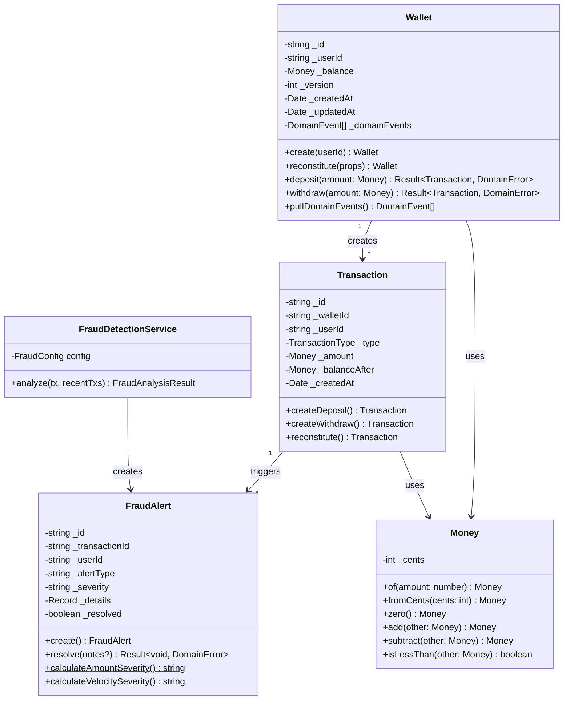
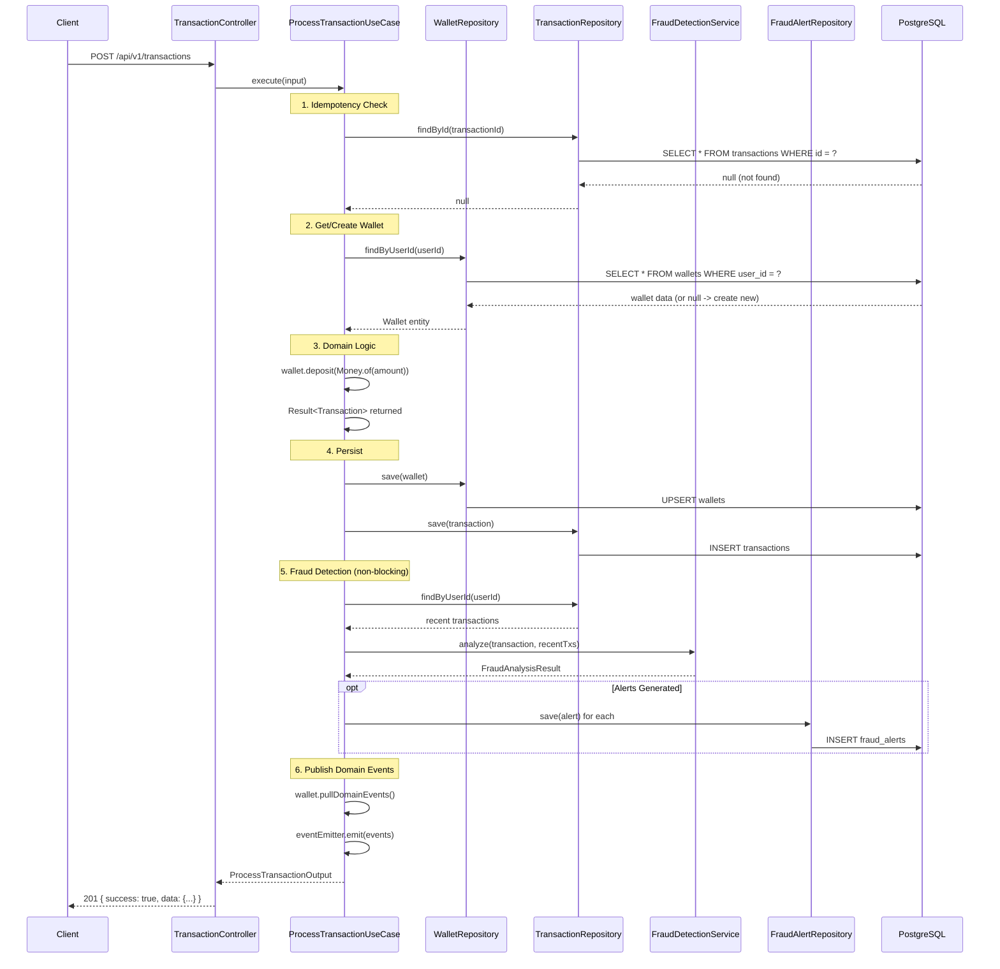

# Architecture Documentation

**Project**: Refacil Wallet - Digital Wallet Microservice
**Pattern**: Clean Architecture (Ports & Adapters)
**Framework**: NestJS 11 + TypeScript 5.7

---

## 1. Clean Architecture Overview

The project implements **Clean Architecture** with four concentric layers. Dependencies only point inward - outer layers depend on inner layers, never the reverse.

```
┌──────────────────────────────────────────────────────────────┐
│                      PRESENTATION                             │
│   Controllers, Request/Response DTOs, Filters, Swagger        │
│   Framework: NestJS decorators (@Controller, @Get, @Post)     │
├──────────────────────────────────────────────────────────────┤
│                      APPLICATION                              │
│   Use Cases, Application DTOs, ApplicationException           │
│   Framework: NestJS DI (@Injectable, @Inject)                 │
├──────────────────────────────────────────────────────────────┤
│                        DOMAIN                                 │
│   Entities, Value Objects, Domain Services, Repository Ports  │
│   Domain Events, Domain Errors, Result<T,E>                   │
│   >>> ZERO external dependencies <<<                          │
├──────────────────────────────────────────────────────────────┤
│                     INFRASTRUCTURE                            │
│   Prisma Repositories, PrismaService, External Integrations   │
│   Framework: NestJS + Prisma ORM                              │
└──────────────────────────────────────────────────────────────┘
```

### Dependency Rule

```
Presentation ──> Application ──> Domain <── Infrastructure
                                   ^              │
                                   │   implements  │
                                   └──────────────┘
```

- **Domain** has ZERO external dependencies (no NestJS, no Prisma, no npm packages)
- **Application** depends on Domain (entities, interfaces, value objects)
- **Infrastructure** implements Domain interfaces (repository ports)
- **Presentation** depends on Application (use cases, DTOs)

---

## 2. Layer Responsibilities

### Domain Layer (`src/domain/`) - 1,909 lines

The innermost layer containing enterprise business rules.

```
src/domain/
├── common/
│   └── result.ts                    # Result<T,E> pattern (no exceptions)
├── entities/
│   ├── wallet.entity.ts             # Aggregate root: balance, deposit, withdraw
│   ├── transaction.entity.ts        # Immutable transaction record
│   └── fraud-alert.entity.ts        # Fraud alert with resolve lifecycle
├── value-objects/
│   ├── money.vo.ts                  # Integer cents, immutable arithmetic
│   ├── transaction-type.vo.ts       # DEPOSIT | WITHDRAW type-safe enum
│   ├── transaction-id.vo.ts         # UUID v4 wrapper with validation
│   └── user-id.vo.ts               # UUID v4 wrapper with validation
├── interfaces/
│   ├── wallet-repository.interface.ts
│   ├── transaction-repository.interface.ts
│   ├── fraud-alert-repository.interface.ts
│   └── injection-tokens.ts          # DI token constants
├── services/
│   └── fraud-detection.service.ts   # Pure domain service (velocity + amount rules)
├── events/
│   ├── domain-event.ts              # Abstract base event
│   ├── transaction-processed.event.ts
│   └── fraud-alert-created.event.ts
├── errors/
│   ├── domain-error.ts              # Abstract base error
│   ├── insufficient-balance.error.ts
│   ├── invalid-amount.error.ts
│   ├── wallet-not-found.error.ts
│   ├── duplicate-transaction.error.ts
│   ├── alert-already-resolved.error.ts
│   └── alert-not-found.error.ts
└── domain.module.ts
```

**Key patterns**:
- **Result<T, E>**: Domain operations return Result instead of throwing exceptions
- **Money as integer cents**: Eliminates floating-point precision errors
- **Aggregate root**: Wallet owns transaction creation (deposit/withdraw)
- **Domain events**: Collected in entities, published by application layer after persistence

### Application Layer (`src/application/`) - 674 lines

Orchestrates domain objects for specific use cases.

```
src/application/
├── use-cases/
│   ├── process-transaction.use-case.ts   # Idempotency + fraud integration
│   ├── get-balance.use-case.ts
│   ├── get-transaction-history.use-case.ts
│   ├── list-fraud-alerts.use-case.ts
│   ├── get-user-alerts.use-case.ts
│   └── resolve-alert.use-case.ts
├── dtos/
│   ├── process-transaction.dto.ts        # Input/Output with isNew flag
│   ├── get-balance.dto.ts
│   ├── get-history.dto.ts
│   └── fraud-alert.dto.ts
├── exceptions/
│   └── application.exception.ts          # Maps DomainError -> HTTP status
└── application.module.ts
```

**Key patterns**:
- **Single responsibility**: One use case class per operation
- **DI via string tokens**: `@Inject(INJECTION_TOKENS.WALLET_REPOSITORY)`
- **ApplicationException**: Bridges domain errors to HTTP-friendly errors
- **Idempotency**: ProcessTransaction checks for duplicate transaction IDs

### Infrastructure Layer (`src/infrastructure/`) - 476 lines

Implements domain interfaces with concrete technology.

```
src/infrastructure/
├── database/
│   └── prisma.service.ts                 # PrismaClient wrapper with transactions
├── repositories/
│   ├── prisma-wallet.repository.ts       # SELECT ... FOR UPDATE locking
│   ├── prisma-transaction.repository.ts  # P2002 unique violation handling
│   └── prisma-fraud-alert.repository.ts
└── infrastructure.module.ts              # Registers repos with DI tokens
```

**Key patterns**:
- **Pessimistic locking**: `findByUserIdWithLock` uses `SELECT ... FOR UPDATE`
- **Entity mapping**: Prisma models <-> Domain entities via `reconstitute()`
- **Money conversion**: `Decimal` (Prisma) <-> `Money.fromCents()` (domain)

### Presentation Layer (`src/presentation/`) - 1,207 lines

Handles HTTP concerns and transforms between HTTP and application layer.

```
src/presentation/
├── controllers/
│   ├── transaction.controller.ts    # POST + GET /api/v1/transactions
│   ├── wallet.controller.ts         # GET /api/v1/wallets/:userId/balance
│   ├── fraud.controller.ts          # GET/PUT /api/v1/fraud/alerts
│   └── health.controller.ts         # GET /health, /health/ready
├── dtos/
│   ├── create-transaction-request.dto.ts  # class-validator decorators
│   ├── transaction-response.dto.ts
│   ├── balance-response.dto.ts
│   ├── fraud-alert-response.dto.ts
│   └── ... (11 total DTOs)
├── filters/
│   └── http-exception.filter.ts     # GlobalExceptionFilter
└── presentation.module.ts
```

**Key patterns**:
- **Validation at boundary**: class-validator decorators on request DTOs
- **Swagger documentation**: @ApiProperty, @ApiOperation, @ApiResponse on everything
- **Exception filter**: Maps ApplicationException -> standard error envelope
- **Response envelope**: `{ success: true, data, meta: { timestamp } }`

---

## 3. Domain Model



---

## 4. Key Flow: Process Transaction



---

## 5. Data Flow: Idempotency

```
Request #1 (new transaction):
  Client ──> Controller ──> UseCase ──> Check DB (not found) ──> Process ──> 201 Created

Request #2 (same transaction_id, same payload):
  Client ──> Controller ──> UseCase ──> Check DB (found, same payload) ──> Return existing ──> 200 OK

Request #3 (same transaction_id, different payload):
  Client ──> Controller ──> UseCase ──> Check DB (found, diff payload) ──> 409 Conflict
```

---

## 6. Database Schema

```
┌──────────────┐     ┌──────────────────┐     ┌─────────────────┐
│   wallets    │     │   transactions   │     │  fraud_alerts   │
├──────────────┤     ├──────────────────┤     ├─────────────────┤
│ id (PK, UUID)│◄────│ wallet_id (FK)   │     │ id (PK, UUID)   │
│ user_id (UQ) │     │ id (PK, UUID)    │◄────│ transaction_id  │
│ balance      │     │ user_id          │     │ user_id         │
│ version      │     │ type (enum)      │     │ alert_type      │
│ created_at   │     │ amount           │     │ severity        │
│ updated_at   │     │ balance_after    │     │ details (JSONB) │
└──────────────┘     │ created_at       │     │ resolved        │
                     └──────────────────┘     │ resolved_at     │
                                              │ resolution_notes│
                     ┌──────────────────┐     │ created_at      │
                     │   audit_logs     │     └─────────────────┘
                     ├──────────────────┤
                     │ id (PK, UUID)    │
                     │ action           │
                     │ entity_type      │
                     │ entity_id        │
                     │ user_id          │
                     │ details (JSONB)  │
                     │ correlation_id   │
                     │ created_at       │
                     └──────────────────┘
```

### Key Design Decisions

| Decision | Rationale |
|----------|-----------|
| Money as Decimal(15,2) | Avoids floating-point errors in financial calculations |
| Transaction.id is client-provided | Enables idempotency without separate idempotency table |
| onDelete: Restrict | Prevents accidental deletion of financial records |
| Pessimistic locking (SELECT FOR UPDATE) | Guarantees consistency for concurrent withdrawals |
| Version field on Wallet | Optimistic locking fallback for read-heavy scenarios |
| JSONB for details/audit | Flexible metadata without schema migrations |

---

## 7. Module Dependency Graph

```
AppModule
├── ConfigModule.forRoot()         # Global config
├── EventEmitterModule.forRoot()   # Domain event publishing
├── ThrottlerModule.forRoot()      # Rate limiting (10/s, 100/min)
├── DomainModule                   # Exports: FraudDetectionService, FraudConfig
├── InfrastructureModule           # Exports: PrismaService, repositories
├── ApplicationModule              # Exports: all use cases
│   ├── imports DomainModule
│   └── imports InfrastructureModule
└── PresentationModule             # Controllers, GlobalExceptionFilter
    ├── imports ApplicationModule
    └── imports InfrastructureModule (for health check)
```

---

## 8. Error Handling Strategy

### Three-Layer Error Model

```
Domain Layer:        Result<T, DomainError>     (no throwing)
                            │
Application Layer:   ApplicationException        (thrown, carries HTTP status)
                            │
Presentation Layer:  GlobalExceptionFilter       (catches, returns JSON envelope)
```

### Error Mapping Table

| Domain Error | HTTP Status | Response |
|-------------|-------------|----------|
| InsufficientBalanceError | 422 | `{ currentBalance, requestedAmount }` |
| InvalidAmountError | 400 | `{ message }` |
| WalletNotFoundError | 404 | `{ userId }` |
| DuplicateTransactionError | 409 | `{ transactionId }` |
| AlertNotFoundError | 404 | `{ alertId }` |
| AlertAlreadyResolvedError | 422 | `{ alertId, resolvedAt }` |
| ValidationError (class-validator) | 400 | `{ errors: [{ field, constraints }] }` |
| Unknown | 500 | Generic message (details logged server-side) |

---

## 9. Security Measures

| Measure | Implementation |
|---------|---------------|
| Input validation | class-validator with whitelist + forbidNonWhitelisted |
| Rate limiting | @nestjs/throttler (10 req/s, 100 req/min per IP) |
| HTTP headers | helmet() middleware (HSTS, X-Content-Type-Options, etc.) |
| No caching | Cache-Control: no-store on all financial responses |
| SQL injection | Prisma parameterized queries |
| Error sanitization | GlobalExceptionFilter never exposes stack traces |

---

> **Document Status**: COMPLETE
> **Architecture**: Clean Architecture (Ports & Adapters)
> **ADRs**: See docs/architecture/decisions/ADR-001 through ADR-004
